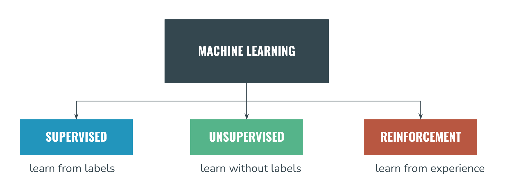

## Best-Classification-Model-Finding-for-Customer-Churn-Prediction part-1
Comparative study of 8 ML classifiers (Random Forest, GBM, ANN, SVM, KNN, DT, LR, NB) on a customer churn dataset. Random Forest achieved the best accuracy of 95.6%.

Purpose of this project is to apply every possible classification algorithms to findout the best model for my project.Machine learning (ML) is generally categorized into 3 types based on how algorithms learn from data: supervised, unsupervised  and reinforcement learning. 

